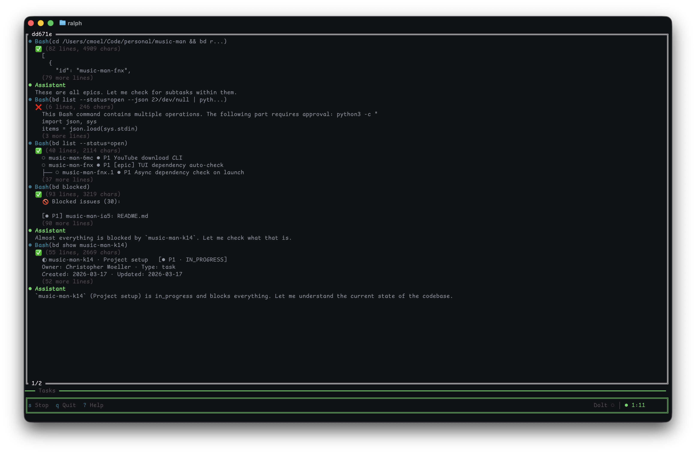

# Ralph

A TUI for running [Ralph loops](https://ghuntley.com/ralph/).



## Installation

### Homebrew (macOS)

```bash
brew install cmoel/tap/ralph
```

### Pre-built Binaries

Download from [GitHub Releases](https://github.com/cmoel/ralph/releases):

- macOS (Intel and Apple Silicon)
- Linux (x86_64 and ARM64)
- Windows (x86_64 and ARM64)

### Build from Source

```bash
git clone https://github.com/cmoel/ralph.git
cd ralph
cargo build --release
```

Binary: `target/release/ralph`

## Prerequisites

- [Claude CLI](https://docs.anthropic.com/en/docs/claude-code) installed and authenticated
- [Beads](https://github.com/steveyegge/beads) (`bd` CLI) installed

## Quick Start

```bash
cd your-project
ralph init        # generates PROMPT.md and scaffolding
ralph             # press s to start, q to quit
```

## How It Works

Ralph runs Claude Code in a loop, feeding it your prompt and work items until everything is complete.

**You provide:**

1. `PROMPT.md` — Instructions for Claude (what to build, constraints, workflow)
2. Work items via [Beads](https://github.com/steveyegge/beads) (`bd` CLI)

**Ralph handles:**

- Spawning Claude with your prompt
- Streaming and formatting output
- Tracking iterations and token usage
- Auto-continuing until all beads are complete (configurable)
- Keeping your system awake during long runs

Press `c` to open the config panel and customize behavior (including switching between beads and specs modes).

## Keyboard Shortcuts

| Key | Action |
|-----|--------|
| `s` | Start/Stop |
| `q` | Quit |
| `c` | Open config panel |
| `l` | Open work items panel |
| `Tab` | Switch panel (Output/Tasks) |
| `t` | Toggle tasks panel collapsed |
| `j` / `↓` | Scroll down |
| `k` / `↑` | Scroll up |
| `Ctrl+d` | Scroll down half page |
| `Ctrl+u` | Scroll up half page |
| `Ctrl+f` | Scroll down full page |
| `Ctrl+b` | Scroll up full page |

## Environment Variables

Override config values for scripting and CI:

| Variable | Description |
|----------|-------------|
| `RALPH_CLAUDE_PATH` | Path to Claude CLI |
| `RALPH_PROMPT_PATH` | Path to prompt file |
| `RALPH_MODE` | Work source mode (`beads` or `specs`) |
| `RALPH_BD_PATH` | Path to `bd` CLI (beads mode) |
| `RALPH_SPECS_DIR` | Path to specs directory (specs mode) |
| `RALPH_LOG` | Log level (debug, info, warn, error) |

<details>
<summary>Using specs mode instead of beads</summary>

Ralph also supports a specs-based workflow where work items are tracked as markdown files.

Set the mode to `specs` via the config panel or `RALPH_MODE=specs`.

**You provide:**

1. `PROMPT.md` — Instructions for Claude (what to build, constraints, workflow)
2. `specs/*.md` — Individual feature specifications
3. `specs/README.md` — Index of all specs with status (Ready, In Progress, Done, Blocked)

Ralph will loop until all specs are marked Done.

</details>

## Contributing

Ralph uses [devbox](https://www.jetify.com/devbox) for development.

```bash
devbox run build    # Compile
devbox run test     # Run tests
devbox run check    # Run clippy
devbox run fmt      # Format code
```

## License

MIT
